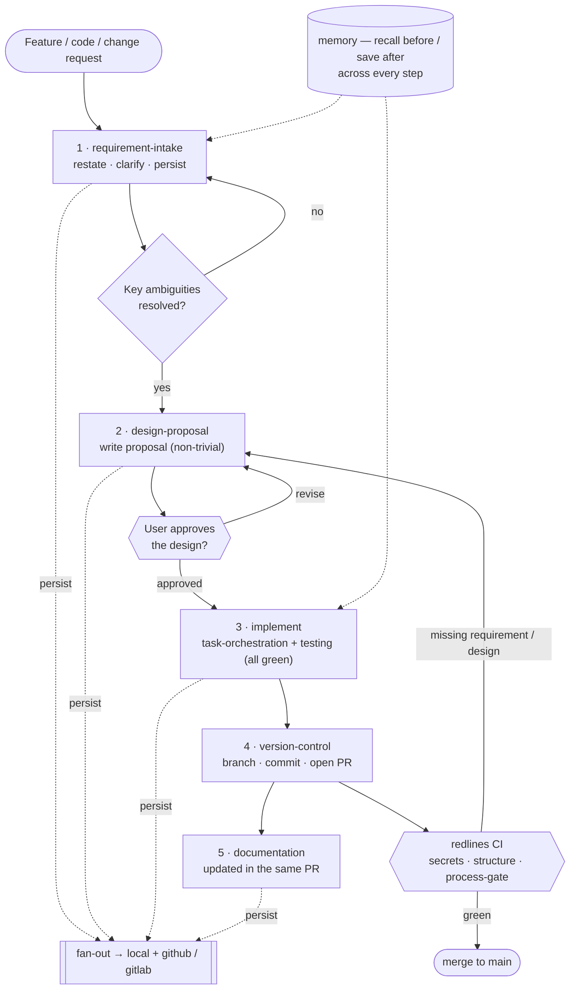

# Grandmaster

**English** | [中文](README.zh-CN.md)

A unified, version-controlled **operating standard for AI agents doing R&D**. Every action — writing design proposals, version control, task orchestration, documentation, memory, notifications, and even the *governance* actions themselves — is codified as a `SKILL.md` (when to use, steps, red lines). Multiple agent tools (Claude Code, Codex, …) share one skill set via **symlinks**, so behavior is consistent; every change goes through **git** — auditable, reviewable, reversible.

> **Why "Grandmaster"?** *Grandmaster (GM)* is the highest title in chess. This project gives your AI agents a grandmaster-level, standardized playbook: instead of each tool improvising its own rules, every agent follows the same disciplined, reproducible process.

## Core ideas

- **Single source of truth** — a skill is defined once under `modules/skills/`; each tool directory (`.claude/skills`, `.codex/skills`) is just a symlink to it.
- **Everything is a module** — `skill` / `provider` / `adapter` / `infra`, each implementing a versioned **contract** in `contracts/`.
- **Governance is skills; the AI is the runtime** — validating, verifying implementations, and onboarding tools are skills auto-triggered by their `description`, not commands. The only non-skill executables are the CI red-line gate and the bootstrap installer.
- **A flow is a file** — adding a process = adding a file (whole-directory symlinks mean no re-sync).
- **Pluggable + fan-out** — a capability can have several providers, chosen in `grandmaster.toml`; write operations fan out to all of them (best-effort). E.g. a requirement clarification is persisted to a local doc **and** a GitHub issue at once.

## The R&D pipeline — how a project using Grandmaster runs

Every task follows this flow (mandatory order):



- **requirement-intake** — restate, clarify, and persist the confirmed requirement; never proceed while key ambiguities remain.
- **design-proposal** — for non-trivial work, write a proposal and **wait for your explicit approval** before any implementation (`status` flips to `Accepted` only after you confirm).
- **implement** — decompose tasks, write / run tests (green before done).
- **version-control** — branch, commit, open a PR (confirm before outward actions); **documentation** rides the same PR.
- **redlines CI** — blocks the PR on secret leaks, structural breakage, or a code PR missing its requirement / design (`[trivial]` may skip design).
- **memory** runs across every step (recall before, save after); each step's output is persisted via **fan-out** to `local` + `github` / `gitlab`. Planning artifacts (requirement, design) thread on the **issue**; change artifacts (test report, docs) on the **PR**.

## Install (one command)

Install the whole ruleset into your repo — no manual clone needed:

```bash
# run in your project root (defaults to the current directory)
curl -fsSL https://raw.githubusercontent.com/youzhixiaomutou/grandmaster/main/install.sh | bash

# with args: target dir / overwrite customizable files / pin a version
curl -fsSL https://raw.githubusercontent.com/youzhixiaomutou/grandmaster/main/install.sh | bash -s -- <target> --force --ref <tag>

# local / offline
./install.sh [target] --src <grandmaster-dir>
```

The installer copies only what's needed (`contracts/`, `modules/`, `grandmaster.toml`, `AGENTS.md`, the CI red-line gate, …) and sets up the `.claude/skills` / `.codex/skills` symlinks — **ready to use**. Your existing `grandmaster.toml` / `AGENTS.md` are kept by default (`--force` to overwrite). Grandmaster's own `docs/` are not included. Requires `curl` + `tar`; the repo must stay public for the one-liner to fetch anonymously.

## Skills

- **Governance**: `skill-authoring`, `verify-implementation`, `tool-onboarding`
- **R&D**: `requirement-intake`, `design-proposal`, `task-orchestration`, `testing`, `version-control`, `documentation`, `memory`
- **Example**: `smoke-example`

## Capabilities & providers

| Capability | Providers | Notes |
|---|---|---|
| `issue` | local / github | requirement records — local doc **and** GitHub issue |
| `design` | local / github | design docs; github = comment on the origin issue |
| `task` | local / github | task plan + test report; github = comment on the PR |
| `doc` | local / github | doc entries; github = comment on the PR |
| `memory` | local | cross-session facts (markdown) |
| `secret-source` | env | fetch secrets by name (values read at runtime, never stored) |

Multi-provider semantics live in `contracts/CONVENTIONS.md` — write ops fan out (best-effort, failures reported); read ops use the first/primary.

> `issue` / `design` / `task` / `doc` also have a `gitlab` provider (`glab`; MR↔PR, issue-note↔comment). Opt-in via `grandmaster.toml` (default is `github`), e.g. `issue = ["local","github","gitlab"]`.

## Layout

```
contracts/    interfaces + Conformance + CONVENTIONS.md
modules/      skills / providers / adapters / infra
profiles/     named provider selections
docs/         designs · requirements · notes · plans (Grandmaster's own; not installed into targets)
install.sh    one-command bootstrap installer
.github/      redlines CI gate + CODEOWNERS
```

## Red lines (always-on, in `AGENTS.md`)

- Never print / commit / echo secrets (names only via `requires_env`, values via `secret-source`).
- Confirm before outward / irreversible actions (push, merge, notify).
- No silent truncation.
- Changing a module goes through a PR.

The CI gate `.github/workflows/redlines.yml` mechanically blocks secret leaks on every PR.

## Design & progress

See `docs/designs/` (`0001` = overall design) and the GitHub Issues. Built through the bootstrap and pluggable phases; next up: `memory` (mysql / mem0), `notification`, `secret-source`.
