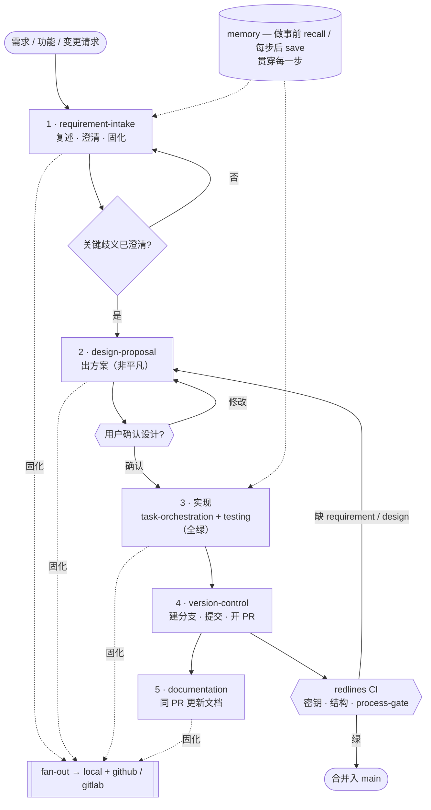

# Grandmaster

[English](README.md) | **中文**

给「用 AI Agent 参与研发」立的一套**统一、可版本控制的操作规程**。研发中的每个动作——写设计方案、版本控制、任务编排、文档、记忆、消息通知，乃至**治理动作本身**——都固化成一份 `SKILL.md`（写清 何时用 / 步骤 / 红线）。多种 Agent 工具（Claude Code、Codex…）通过**软链接**共享同一套技能，行为一致；所有改动走 **git**——可审查、可回溯、可回滚。

> **名字来源。** *Grandmaster（GM，特级大师）* 是国际象棋的最高称号。本项目给你的 AI Agent 一套"特级大师级"的标准棋谱：不再各工具各自放飞，每个 Agent 都遵循同一套有纪律、可复现的流程。

## 核心理念

- **单一事实源**——技能只在 `modules/skills/` 定义一处；各工具目录（`.claude/skills`、`.codex/skills`）只是指向它的软链接。
- **一切皆模块**——`skill` / `provider` / `adapter` / `infra`，各自实现 `contracts/` 里带版本的**契约**。
- **治理即 skill，AI 即运行时**——校验、验证实现、接入工具都是靠 `description` 自动触发的技能，不是命令。唯一的非-skill 可执行物是 CI 红线兜底与 bootstrap 安装脚本。
- **文件即流程**——加一条流程 = 加一个文件（整目录软链接，连"同步"都不用跑）。
- **可插拔 + fan-out**——一个能力可配多个 provider，在 `grandmaster.toml` 选择；写操作 fan-out 到全部（尽力而为）。例如需求澄清结论**同时**固化到本地文档**和** GitHub issue。

## 研发流水线 —— 使用 Grandmaster 的项目如何运转

每个任务都按此流程（强制顺序）：



- **requirement-intake** —— 复述、澄清、固化确认结论；关键歧义未清不动手。
- **design-proposal** —— 非平凡改动先出方案，并**等你明确确认**后才实现（`status` 仅你确认后标 `Accepted`）。
- **实现** —— 拆解任务 + 写 / 跑测试（全绿才算完成）。
- **version-control** —— 建分支、提交、开 PR（对外操作先确认）；**documentation** 同 PR 更新。
- **redlines CI** —— 对密钥泄漏、结构破坏、或"涉代码却缺 requirement / design"的 PR 打红（`[trivial]` 可跳 design）。
- **memory** 贯穿每一步（做事前 recall、每步后 save）；每步产出经 **fan-out** 固化到 `local` + `github` / `gitlab`。规划产物（需求、设计）挂在 **issue**；改动产物（测试报告、文档）挂在 **PR**。

## 安装（一条命令）

把整套规程装进你的仓库——**无需手动 clone**：

```bash
# 在你的项目根目录执行（缺省装到当前目录）
curl -fsSL https://raw.githubusercontent.com/youzhixiaomutou/grandmaster/main/install.sh | bash

# 带参数：指定目录 / 覆盖已有可定制文件 / 指定版本
curl -fsSL https://raw.githubusercontent.com/youzhixiaomutou/grandmaster/main/install.sh | bash -s -- <target> --force --ref <tag>

# 本地 / 离线
./install.sh [target] --src <grandmaster 目录>
```

脚本只拷贝使用所必需（`contracts/`、`modules/`、`grandmaster.toml`、`AGENTS.md`、CI 红线兜底 …），并建好 `.claude/skills` / `.codex/skills` 软链接——**装完即用**。目标已有的 `grandmaster.toml` / `AGENTS.md` 默认保留（`--force` 覆盖）。**不含** Grandmaster 自身的 `docs/`。依赖 `curl` + `tar`；一条命令匿名拉取需仓库保持 public。

## 技能

- **治理**：`skill-authoring`、`verify-implementation`、`tool-onboarding`
- **研发**：`requirement-intake`、`design-proposal`、`task-orchestration`、`testing`、`version-control`、`documentation`、`memory`
- **示例**：`smoke-example`

## 能力与实现

| 能力 | Provider | 说明 |
|---|---|---|
| `issue` | local / github | 需求记录——本地文档**与** GitHub issue |
| `design` | local / github | 设计文档；github = 评论到原 issue |
| `task` | local / github | 任务计划 + 测试报告；github = 评论到 PR |
| `doc` | local / github | 文档条目；github = 评论到 PR |
| `memory` | local | 跨会话事实（markdown） |
| `secret-source` | env | 按名取密钥（值只运行期读取，绝不入库） |

多 provider 语义见 `contracts/CONVENTIONS.md`——写类 fan-out（尽力而为、失败显式报告），读类取首个 / 主。

> `issue` / `design` / `task` / `doc` 另有 `gitlab` provider（`glab`；MR↔PR、issue-note↔评论）。默认 `github`，可在 `grandmaster.toml` 启用，例：`issue = ["local","github","gitlab"]`。

## 目录

```
contracts/    接口 + Conformance + CONVENTIONS.md
modules/      skills / providers / adapters / infra
profiles/     命名的 provider 选择集
docs/         designs · requirements · notes · plans（Grandmaster 自身；不装入目标仓库）
install.sh    一条命令 bootstrap 安装脚本
.github/      redlines CI 兜底 + CODEOWNERS
```

## 红线（always-on，见 `AGENTS.md`）

- 绝不打印 / 提交 / 回显密钥（只经 `requires_env` 声明名字，值经 `secret-source`）。
- 对外 / 不可逆操作（push、merge、发通知）先确认。
- 不静默截断。
- 改模块必经 PR。

CI 兜底 `.github/workflows/redlines.yml` 在每个 PR 上机械拦截密钥泄漏。

## 设计与进度

见 `docs/designs/`（`0001` = 总设计）与 GitHub Issues。已完成 bootstrap 与可插拔各阶段；后续：`memory`（mysql / mem0）、`notification`、`secret-source`。
