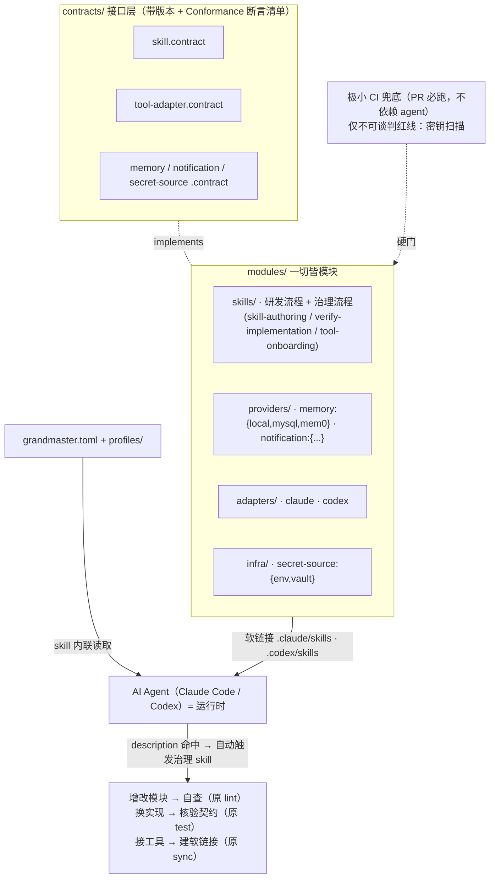

# 0001 · Grandmaster 详细设计

- **状态**: Proposed（评审中，见 [Issue #1](https://github.com/youzhixiaomutou/grandmaster/issues/1)）
- **版本**: v3（纯 skill 驱动）
- **日期**: 2026-07-30

> 本文件由 `design-proposal` 技能沉淀自 Issue #1。演进：v1 = SKILL.md + 软链接 + git 治理；v2 = 升格为统一模块协议；v3 = 治理即 skill、AI 即运行时、一道极小 CI 兜底。

## 1. 背景与目标

当前用 AI Agent 参与研发存在结构性问题：**每个工具各写一套、放飞自流**。同一条"怎么提交代码 / 怎么写设计 / 怎么记忆 / 怎么发通知"的规矩，在 Claude Code 的 `CLAUDE.md`、Codex 的 `AGENTS.md` 里被重复描述、措辞不一、红线不齐，散落各处、无法审查、无法回溯。

**Grandmaster 的目标：为"AI Agent 参与研发"建立一套统一规程（单一事实源），以"模块 + 多实现"组织，并让每个动作（含治理动作自身）都以 skill 形式、靠 AI 自动触发来执行。**

研发中每个动作——写设计方案、版本控制、任务编排、文档、记忆、消息通知——都固化成一份 `SKILL.md`，写清 **何时用 / 按什么步骤做 / 有哪些红线**。多种 Agent 工具（Claude Code、Codex……）通过**软链接**共享同一套 `SKILL.md`，行为一致；所有改动走 **git**，可审查、可回溯、可回滚。

进一步地，**能力与实现分离**：像"记忆"这类能力，其"做什么"（契约）稳定不变，"怎么做 / 存哪"（实现）可在 本地 / MySQL / mem0 间安全替换；而且这不是特例，**技能、后端实现、工具接入、横切基础设施，全部遵循同一套模块协议**。于是"加一条流程只是加一个文件""换一种实现只是改一行配置""接一个新工具只是加一个适配模块"。

**关键立意（v3）**：连"校验模块是否合规、验证实现是否满足契约、把技能同步给工具"这些**治理动作，也是 skill**——不是要你敲的命令。AI 读到匹配的 `description` 就自动触发、按步骤做。这正是 Claude Code / Codex 的原生机制（description 命中即隐式加载技能）。

### 非目标（Non-Goals）
- **不引入任何自定义 CLI / 子命令 / 脚本框架**。治理靠 skill 自动触发；唯一的非-skill 可执行物是 CI 上一道极小红线兜底。
- 不发明新的 Agent 运行时或新的 SKILL 格式——复用 Anthropic 定义、已被 Codex 采纳的既有 `SKILL.md` 事实标准。
- v1 不追求覆盖所有工具——以 Claude Code + Codex 打样，架构上保证可扩展到第三种工具。

---

## 2. 设计原则

| # | 原则 | 含义 |
|---|------|------|
| P1 | **单一事实源** | 每条规程只有一处权威定义，其余全是它的软链接或投影。 |
| P2 | **一切皆模块** | 技能/实现/工具/基础设施都是"自描述目录 + 清单 + 实现某契约"，同构可组合。 |
| P3 | **面向契约,不面向实现** | 模块依赖"能力(契约)"，从不点名具体后端；激活实现由 skill 步骤内联读配置决定。 |
| P4 | **治理即 skill，AI 即运行时** | 校验/验证/同步等治理动作都是 skill，靠 `description` 自动触发，不引入命令。 |
| P5 | **文件即流程** | 加/改/删模块 == 加/改/删文件，走 PR。整目录软链接下，加技能连"同步"都不用跑。 |
| P6 | **一切经 Git** | 演进 = commit 历史。`git log`/`git blame` 即审计轨迹与责任归属。 |
| P7 | **替换即安全** | 每个契约带一份**断言清单**；换实现时由"验证实现"skill 逐条核验后才启用。 |
| P8 | **红线双保险** | 结构化字段 + skill 自动自查；**不可谈判红线（如密钥）另有一道极小 CI 硬门**（PR 必跑、不依赖 agent）。 |
| P9 | **渐进披露** | 平时只加载技能 name+description（约 50–100 token/条），命中才加载正文。 |
| P10 | **可自举** | Grandmaster 用自己的（治理）技能治理自己的演进。 |

---

## 3. 核心概念

- **Module（模块）**：架构基本单元。自描述目录，声明**清单**、**实现某个具名带版本的契约**。四种 `kind`：`skill` / `provider` / `adapter` / `infra`。
- **Contract（契约）**：一等公民的**接口**。`contracts/<id>.contract.md` 声明操作、I/O、错误语义，并内含一份 **`## Conformance` 断言清单**（自然语言、可逐条核）。带 semver。
- **Capability（能力）**：由"一个契约 + 若干 provider"构成的可插拔点，例：`memory`、`notification`、`secret-source`。
- **Provider（实现方）**：某能力的具体后端（`kind=provider`），`provides` 某能力且 `implements` 其契约。例：memory 的 `local`/`mysql`/`mem0`。
- **Adapter（工具适配）**：某工具的接入（`kind=adapter`），`implements: tool-adapter.contract`。例：`claude`/`codex`。
- **Infra（基础设施）**：横切模块（`kind=infra`），如 `secret-source`（`env`/`vault`）。
- **治理技能（Governance skills）**：把原本要靠工具做的事变成 AI 自动触发的流程——
  - `skill-authoring`：新增/修改模块时触发，含**自查**（原 lint：字段/分节/红线/依赖图/description 低重叠/密钥特征）。
  - `verify-implementation`：新增/替换某能力实现时触发，按契约 `## Conformance` 逐条**核验**（原 test）。
  - `tool-onboarding`：接入新工具/初始化仓库时触发，建立**软链接**与 `.codex/config.toml`（原 sync）。
- **Profile（选择集）**：命名的实现组合（`profiles/local-dev.toml` 等）。skill 步骤内联读取以决定激活实现。
- **CI 红线兜底（minimal）**：全仓库唯一的机器硬门。只查不可谈判红线（密钥扫描为主，可含极少可 grep 的结构断言）。**不是命令，是 PR 门。**

> 已去除：预生成的 registry 索引（AI 直接读 `modules/**` 即有全局视图）、独立的 resolve 步骤（skill 内联读 `grandmaster.toml`）。

---

## 4. 总体架构



**一句话**：`contracts/` 定接口 → `modules/` 提供各种实现 → AI 经软链接看到同一批 skill、按 `description` 自动触发（含治理 skill）→ 增改/校验/同步都由 AI 执行；唯一的机器硬门是 CI 上只查密钥类红线的极小兜底。**四个可插拔维度（能力/实现/工具/基础设施）走同一套模块协议。**

---

## 5. 统一模块协议（架构核心）

### 5.1 Module 定义与清单
每个模块是目录 + 一份**清单**：技能（`kind=skill`）用 `SKILL.md` 的 YAML frontmatter（对工具可见）；其余（provider/adapter/infra）用 `module.toml`。统一字段：

| 字段 | 说明 |
|------|------|
| `kind` | `skill` / `provider` / `adapter` / `infra` |
| `name` | 全局唯一 kebab-case（技能须等于目录名） |
| `version` | 语义化版本 |
| `implements` | 实现的契约，如 `memory.contract@^1` |
| `provides` | （provider）所提供的能力，如 `memory` |
| `requires` | 依赖的**能力**列表（非实现） |
| `requires_env` | 运行期所需环境变量**名**（只声明名字，绝不写值） |
| `metadata.owner` / `metadata.status` | 负责人 / `draft`·`active`·`deprecated` |

### 5.2 Contract + Conformance（断言清单）
`contracts/<id>.contract.md` 定义操作/语义/错误约定，并内含 **`## Conformance`** 一节：一串自然语言断言（例：memory —"save 后 recall 同键能取回""forget 后 recall 取不到""缺失键返回空而非报错"）。规则：

> **任何 provider/adapter 启用前，须由 `verify-implementation` 技能对照该清单逐条核验通过。** 这是"记忆从本地换 MySQL 再换 mem0、调用方零感知"能成立的保证——由 AI 在替换时自动触发核验，而非事后靠人记得。

### 5.3 面向能力的依赖注入
模块只声明 `requires: [memory, secret-source]` 这类**能力**，绝不点名具体实现。执行期**文档驱动**：技能在 Procedure 里写"读 `grandmaster.toml`（+激活 profile）得知 memory 当前实现，按 `modules/providers/memory/<impl>/impl.md` 执行"。无独立 resolve 步骤、无代码运行时。

### 5.4 发现与选择
- **发现**：AI 直接读 `modules/**` 与 `contracts/**` 即得全局视图（谁是谁、有哪些实现、谁依赖谁）；无需预生成索引。`skill-authoring` 自查时顺带校验依赖图无环/无悬空。
- **选择**：`grandmaster.toml` + 激活 `profile` 指定 能力→provider、工具→adapter；skill 步骤内联读取。优先级 repo < 用户 < 环境变量（如 `GM_CAP_memory=mysql` 临时覆盖）。

### 5.5 扩展模型（全部"丢一个符合契约的目录",核心零改动）

| 想做 | 操作 |
|------|------|
| 加流程 | 加 `modules/skills/<name>/SKILL.md`（整目录软链接下，**连同步都不用跑**） |
| 加能力 | 加 `contracts/<x>.contract.md`（含 Conformance）+ ≥1 provider |
| 换/加实现 | 加 `modules/providers/<x>/<impl>/`，经 `verify-implementation` 核验 → 配置里切换 |
| 接新工具 | 加 `modules/adapters/<tool>/`（implements `tool-adapter.contract`）+ `tool-onboarding` 建软链接 |
| 换基础设施 | 加 `modules/infra/<x>/<impl>/`（如 secret 从 `env` 换 `vault`，无感） |

---

## 6. 目录布局

```
grandmaster/
├─ README.md
├─ AGENTS.md                     # always-on 跨工具基线（全局红线/约定）= 唯一源
├─ CLAUDE.md  ->  AGENTS.md       # 软链接：Claude 读 CLAUDE.md，内容一致
├─ grandmaster.toml               # active profile + 能力→provider、工具→adapter、软链接策略
│
├─ contracts/                     # ★ 接口层（一等公民、带版本、每份含 ## Conformance 断言清单）
│  ├─ skill.contract.md
│  ├─ tool-adapter.contract.md
│  ├─ memory.contract.md
│  ├─ notification.contract.md
│  └─ secret-source.contract.md
│
├─ modules/                       # ★ 实现层（一切皆模块，按 kind 归类）
│  ├─ skills/                     #   kind=skill（经软链接暴露给工具）
│  │  ├─ skill-authoring/SKILL.md      #  治理：新增/修改模块 + 自查（原 lint）
│  │  ├─ verify-implementation/SKILL.md #  治理：按契约 Conformance 核验实现（原 test）
│  │  ├─ tool-onboarding/SKILL.md       #  治理：接入工具 → 建软链接 + config（原 sync）
│  │  ├─ design-proposal/SKILL.md
│  │  ├─ version-control/SKILL.md
│  │  ├─ task-orchestration/SKILL.md
│  │  ├─ documentation/SKILL.md
│  │  ├─ memory/SKILL.md          #   requires: [memory]
│  │  └─ notification/SKILL.md     #   requires: [notification]
│  ├─ providers/
│  │  ├─ memory/{local,mysql,mem0}/{module.toml,impl.md}
│  │  └─ notification/{webhook,slack,email}/{module.toml,impl.md}
│  ├─ adapters/
│  │  ├─ claude/module.toml
│  │  └─ codex/module.toml
│  └─ infra/
│     └─ secret-source/{env,vault}/{module.toml,impl.md}
│
├─ profiles/{local-dev,ci,team}.toml
│
├─ docs/designs/                  # 通过评审的设计（本 Issue → 0001-grandmaster.md）
├─ .github/
│  ├─ workflows/redlines.yml      # 极小 CI 兜底：密钥扫描（+可选结构断言）。唯一非-skill 可执行物
│  └─ CODEOWNERS                  # contracts/** modules/** 需 owner 评审
│
├─ .claude/{ skills -> ../modules/skills, settings.json, agents/ }
└─ .codex/{ skills -> ../modules/skills, config.toml }
```

> 关于命名重叠：`memory`/`notification` 既是**能力**（契约+providers），又各有一个同名**技能**（规定"何时用"并调用该能力）；`secret-source` 是纯基础设施能力、无对应技能。工具只看得到 `skills/`；providers/contracts/infra 在 skill 步骤里被读取，不直接暴露给工具。**没有 `bin/`、没有 registry 索引文件。**

---

## 7. 清单与 `SKILL.md` 房规
技能 frontmatter（= `skill.contract` 约束）必填：`name`(==目录名)、`description`(触发文本,自动触发唯一依据,须具体可区分)、`version`、`kind: skill`、`implements: skill.contract@^1`、`metadata.owner`、`metadata.status`。可选：`requires`、`allowed-tools`、`guardrails.write_file.{allowed_paths,policy}`、`requires_env`、`user-invocable`、`disable-model-invocation`、`metadata.tags`、`related`。

**必备正文分节（skill-authoring 自查强制）**：`When to use / When NOT to use` → `Inputs/Preconditions` → `Procedure` → `🚫 Red lines` → `Outputs/Definition of Done` → `Related`（`[[name]]` 互链）。

> **治理技能就是普通技能**——只是它们的 `description` 描述的是"增改模块/换实现/接工具"这类时机，从而在研发过程中被 AI 自动触发。

---

## 8. 契约清单（v1）

| 契约 | 操作/职责 | Conformance 断言（示例，由 skill 核验） |
|------|-----------|------------------------------------------|
| `skill.contract` | 合格技能的 frontmatter + 必备分节 + 红线 | 字段齐全、`name`==目录名、分节齐全、🚫 存在、description 低重叠 |
| `tool-adapter.contract` | 声明：技能目录路径、always-on 文件、开关机制、是否支持软链接、如何建粘合件 | `tool-onboarding` 执行后，目标工具能发现并调用冒烟技能 |
| `memory.contract` | `save`/`recall`/`forget` | 存后能召回、forget 后取不到、缺失键返回空 |
| `notification.contract` | `notify(channel,message,level)`；干跑 | 干跑不外发、消息体不含密钥、目标可追溯 |
| `secret-source.contract` | `get(name)->value`（名字来自 `requires_env`） | 未声明的名字取不到、值不被回显/记录 |

---

## 9. 首批模块清单（v1）

**治理 Skills（kind=skill）**
- `skill-authoring`（自举）：增改任何模块时触发。步骤：复制同类模板生成骨架 → 填清单+正文 → **自查**（字段/分节/🚫/依赖图/description 低重叠/密钥特征）→ PR。🚫 不得引入高重叠 description；不得手改工具目录软链接目标。
- `verify-implementation`：新增/替换某能力实现时触发，对照契约 `## Conformance` 逐条核验，全过才允许在配置里启用。
- `tool-onboarding`：接入新工具/初始化仓库时触发，建 `.claude/skills`、`.codex/skills` 软链接、`CLAUDE.md->AGENTS.md`、生成 `.codex/config.toml`（不支持软链接时 `--copy` 物化）。

**研发 Skills**
- `design-proposal`：非平凡改动先出设计（本 Issue 即首个实例）。🚫 无评审不进实现。
- `version-control`：分支/提交/合并/PR。🚫 绝不提交密钥；push/merge 前先确认；不强推主干；提交含 `Co-Authored-By` 尾注。
- `task-orchestration`：≥3 步/可并行/需拆解时。🚫 不静默截断范围。
- `documentation`：交付/变更约定后。🚫 不与代码/红线不一致、不复制敏感信息。
- `memory` / `notification`：规定"何时存取/通知"，`requires` 对应能力，运行期内联读配置调用激活实现。

**Providers**：`memory`:{`local`(默认),`mysql`,`mem0`}；`notification`:{`webhook`,`slack`,`email`}
**Adapters**：`claude` / `codex`
**Infra**：`secret-source`:{`env`(默认),`vault`}

---

## 10. 可插拔机制详解（四维度实例）
- **换实现（memory: local→mysql→mem0）**：`grandmaster.toml` 里 `[capabilities] memory="mysql"`（或用 `profiles/team.toml`）。mysql provider `requires_env=["GM_MEMORY_MYSQL_DSN"]`、`requires=[secret-source]`。启用前 `verify-implementation` 自动触发、按 `memory.contract` 的 Conformance 逐条核验。`memory` 技能调用方零改动。
- **加能力**：加 `contracts/vectorstore.contract.md`（含 Conformance）+ `modules/providers/vectorstore/{pgvector,qdrant}/`。
- **接新工具（如 cursor）**：加 `modules/adapters/cursor/`（实现 `tool-adapter.contract`），`tool-onboarding` 建软链接与粘合件。核心零改。
- **换基础设施（secret: env→vault）**：`[capabilities] secret-source="vault"`；所有 `requires:[secret-source]` 的实现自动改经 vault，**声明只写变量名、值永不入库**。

---

## 11. 红线库（Red-line Library）
**全局红线**（写入 `AGENTS.md`/`CLAUDE.md`，always-on）
- 🚫 绝不打印/提交/回显密钥：只经 `requires_env` 声明名字、运行期经 `secret-source` 读取。
- 🚫 对外操作先确认：push/merge/发通知/调外部服务等外向动作，未获持久授权前先确认。
- 🚫 不静默截断：凡范围裁剪（top-N/采样/跳步）必须显式说明。
- 🚫 改模块必经 PR：不得手改工具目录软链接目标。

**双保险落地**
1. **skill 自查（主）**：`skill-authoring` 自动触发时对照红线逐条检查；`requires_env`+`guardrails` 结构化声明；涉外技能（notification/version-control）Procedure **必须含"确认门"步骤**。
2. **CI 极小兜底（硬门）**：`.github/workflows/redlines.yml` 在每个 PR 上跑，**仅**做不可谈判红线——密钥扫描（如 gitleaks/正则）为主，可含极少可 grep 的结构断言（如 `name`==目录名）。不依赖 agent 是否触发，含密钥的 PR 直接失败。

---

## 12. 附录

### 12.1 `module.toml` 样例（memory-mysql provider）
```toml
kind = "provider"
name = "memory-mysql"
version = "0.1.0"
implements = "memory.contract@^1"
provides = "memory"
requires = ["secret-source"]
requires_env = ["GM_MEMORY_MYSQL_DSN"]   # 只声明名字，绝不写值
[metadata]
owner = "@core"
status = "active"
```

### 12.2 `grandmaster.toml` 样例
```toml
active_profile = "local-dev"
[capabilities]           # 能力 → 激活 provider（profile 可覆盖，env 最高优先）
memory = "local"
notification = "webhook"
secret-source = "env"
[tools]
enabled = ["claude", "codex"]
[link]
granularity = "dir"      # dir（整目录软链接，默认，加技能免同步）| per-skill
mode = "symlink"         # symlink（默认）| copy（不支持软链接时物化）
```

### 12.3 `SKILL.md` 样例（`memory` 技能，展示内联依赖注入）
```markdown
---
name: memory
description: 需要跨会话持久化或召回稳定事实时使用；规定何时存/召回/遗忘，并经激活的 memory 实现执行。
version: 0.1.0
kind: skill
implements: skill.contract@^1
requires: [memory, secret-source]
metadata: { owner: "@core", status: active, tags: [memory] }
related: [documentation]
---

## When to use / When NOT to use
- 用：跨会话需要记住/召回的稳定事实。 不用：仅本会话的临时信息。

## Procedure
1. 读 `grandmaster.toml [capabilities].memory` 得知激活实现。
2. 按 `modules/providers/memory/<impl>/impl.md` 执行 save/recall/forget。
3. 需凭据时经 `secret-source` 获取（只用 requires_env 声明的变量名）。

## 🚫 Red lines
- 不记录密钥/敏感值；凭据只经 secret-source。
- 切换 provider 不改变本技能对外行为（由 memory.contract 的 Conformance 保证）。

## Outputs / Definition of Done
- 事实已持久化且可被 recall；操作可回溯。

## Related
- [[documentation]]
```

### 12.4 事实依据（工具机制）
- 已核实：Claude Code 与 Codex **均按 `description` 隐式加载/自动触发技能**，且**均以软链接发现技能**；本机既有先例（`.claude/skills/* -> ../../.frame/skills/*`）。
- 已核实：`SKILL.md` 为二者共用格式；Codex 项目级 `.codex/skills/`，经 `config.toml` 的 `[[skills.config]]` 开关，`AGENTS.md` 承载 always-on；旧 `~/.codex/prompts` 自定义提示**已废弃**、统一走 Skills。
- `AGENTS.md` 作为 `CLAUDE.md` 软链接是业界既有约定。

### 12.5 参考资料
- OpenAI Codex — Build skills: https://developers.openai.com/codex/skills
- OpenAI Codex — Custom instructions with AGENTS.md: https://developers.openai.com/codex/guides/agents-md
- OpenAI Codex — Customization: https://developers.openai.com/codex/concepts/customization
- OpenAI Codex — Custom Prompts（废弃说明）: https://developers.openai.com/codex/custom-prompts
- AI Agent Skills 指南（SKILL.md / Claude Code / Codex）: https://www.thepromptindex.com/how-to-use-ai-agent-skills-the-complete-guide.html
- Claude Code 官方文档: https://code.claude.com/docs

---

## 13. Git 治理与可审查
- **一切经 PR**：`contracts/**`、`modules/**` 改动经 `.github/CODEOWNERS` 要 owner 评审。
- **校验以 skill 为主**：`skill-authoring` 自查（schema/红线/依赖图/description 低重叠/密钥特征）、`verify-implementation` 按 Conformance 核验——均由 AI 在增改时**自动触发**。
- **CI 只有一道极小兜底**：`redlines.yml`，仅不可谈判红线（密钥扫描 + 可选结构断言），PR 必跑、不依赖 agent。**它不是命令，是构建门。**
- **审计**：`git log -- modules/<x>` = 演进史；`git blame` + PR 链 = 谁/为何/何时改了哪条规矩；回滚 = `git revert`。

---

## 14. 引导 / 自举（Bootstrap）
Phase 0 交付"刚好够用"的一小撮东西，使此后每个模块都经被治理的（skill）流程加入：
1. `contracts/`（`skill.contract` + `tool-adapter.contract`，含 Conformance）
2. 模块协议与清单规范（文档）
3. 治理技能：`skill-authoring` + `verify-implementation` + `tool-onboarding`
4. 研发技能：`design-proposal` + `version-control`；`claude`/`codex` 适配模块
5. `AGENTS.md` + `CLAUDE.md`（软链接）基线红线；`.github/workflows/redlines.yml`（密钥兜底）+ CODEOWNERS

闭环："本 Issue" 是 `design-proposal` 首个产物；通过后经 `version-control` 落 `docs/designs/0001-grandmaster.md`；其余模块均经 `skill-authoring` 加入。

---

## 15. 分阶段路线图

| 阶段 | 内容 | 完成即具备 |
|------|------|-----------|
| **P0 引导** | contracts(skill+tool-adapter) + 模块协议 + 治理技能(skill-authoring/verify-implementation/tool-onboarding) + design-proposal/version-control + claude/codex 适配 + redlines.yml + CODEOWNERS | 可自举：之后每个模块都经 skill 流程加入 |
| **P1 核心研发环** | `task-orchestration` + `documentation` | 规划→实现→审查→合并全链路有稳定路径 |
| **P2 可插拔服务** | `memory`（契约+local，补 mysql/mem0 过 Conformance）+ `notification`（webhook/slack）+ `secret-source`（env，补 vault）；用 profile 演示热切换 | 验证"契约稳定、实现可换" |
| **P3 治理硬化** | 更多契约、第 3 种工具适配（验证中立性）、更细 Conformance、以 `.claude-plugin/plugin.json` 形式分发以便跨仓复用 | 跨仓库复用、可信治理 |

---

## 16. 验收标准（P0 Definition of Done）
- [ ] `contracts/`（skill + tool-adapter，含 `## Conformance`）就位；模块协议 + 清单规范文档化。
- [ ] 治理技能 `skill-authoring`/`verify-implementation`/`tool-onboarding` 就位，`description` 能被 AI 自动触发；三者可自查通过。
- [ ] `design-proposal`/`version-control` 就位。
- [ ] `tool-onboarding` 建好 `.claude/skills`、`.codex/skills` 软链接与 `.codex/config.toml`；**Claude Code 与 Codex 均能发现并调用**冒烟技能。
- [ ] `.github/workflows/redlines.yml` 在含密钥的 PR 上**能让构建失败**；CODEOWNERS 生效。
- [ ] `AGENTS.md` + `CLAUDE.md`（软链接）承载全局红线。
- [ ] 本设计沉淀为 `docs/designs/0001-grandmaster.md`。

---

## 17. 决策记录（Decisions）

**全部决策已敲定，设计参数锁定，可进入 P0 实现。**

**机制（v3，本轮）**
| # | 议题 | 决定 |
|---|------|------|
| M1 | 治理动作载体 | **全部是 skill，靠 `description` 自动触发**；不引入命令/CLI/脚本框架 |
| M2 | 硬红线兜底 | 保留**一道极小 CI 门**（`redlines.yml`），**仅**查不可谈判红线（密钥扫描为主，可含极少结构断言） |

**较早已定（含本轮修订）**
| # | 议题 | 决定 |
|---|------|------|
| O1 | 软链接粒度 | 默认整目录（加技能免同步）；可配 per-skill |
| O2 | 配置格式 | TOML（`grandmaster.toml` / `profiles/*.toml`） |
| O3 | always-on | `CLAUDE.md` 软链接 → `AGENTS.md` |
| O4 | 无软链接环境 | `tool-onboarding` 支持 `--copy` 物化 |
| N1 | 技能清单形式 | 扩展 `SKILL.md` frontmatter；provider/adapter/infra 用 `module.toml` |
| N2 | Conformance 形式 | **改为**：契约内 `## Conformance` **断言清单**，由 `verify-implementation` 技能逐条核验（**不再用 shell 脚本**） |
| N3 | 能力/技能同名 | 保持同名，文档说明 |
| N4 | 注册表索引 | **改为取消**：AI 直接读 `modules/**`，不预生成 `registry/index.json` |
| N5 | 解析器 | **改为取消独立步骤**：skill 内联读 `grandmaster.toml` |
| O7 | 密钥来源 | 走 `secret-source` 的 `env` 实现（名字在 `requires_env` 声明） |

---

*本 Issue 由设计评审驱动；设计参数已锁定（治理即 skill、AI 即运行时、一道极小 CI 兜底），按 §15 路线图分阶段实现。*
